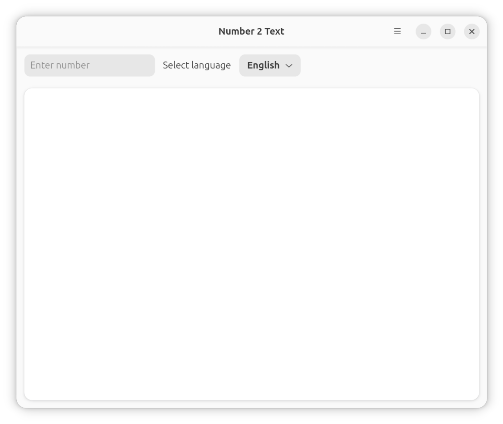
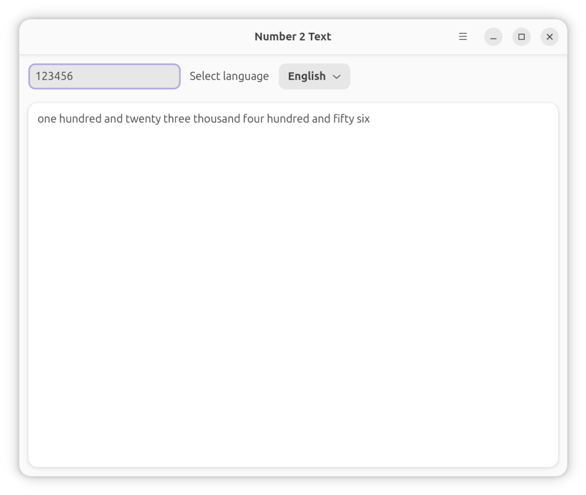
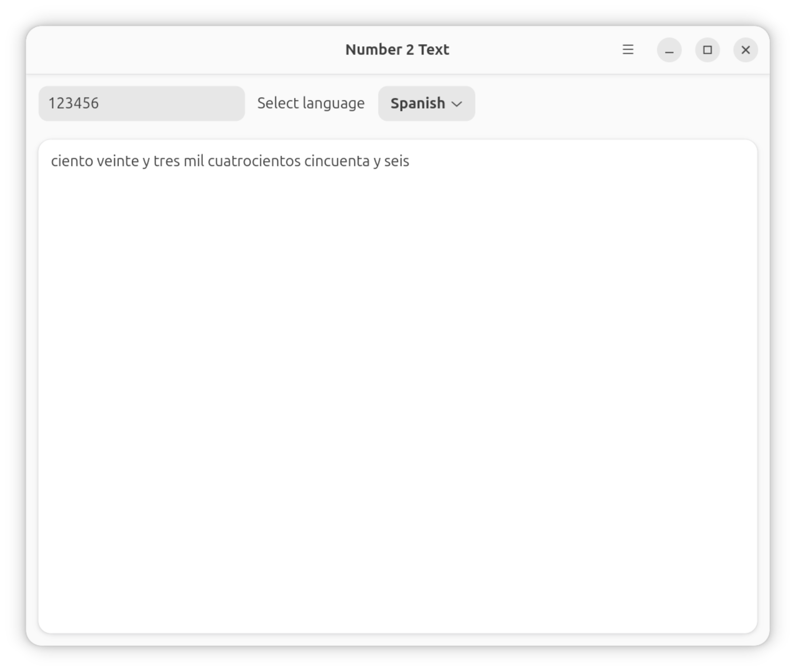

# Number 2 Text

Number 2 Text is a free, open-source application to convert numbers to text.

## Supported Languages

* English
* Spanish
* German
* French
* Italian
* Russian

## Usage

### GUI Mode

Launch the application without arguments to open the graphical interface:

```bash
number2text
```

### Command Line Mode

Convert numbers to text directly from the command line:

```bash
number2text --language <LANGUAGE> <NUMBER>
```

#### Options

- `-l, --language`: Specify the language for conversion
  - Possible values: `en` (English), `fr` (French), `de` (German), `it` (Italian), `ru` (Russian), `es` (Spanish)
- `-h, --help`: Display help information
- `-V, --version`: Display version information

#### Examples

Convert a number to English:
```bash
number2text --language en 42
# Output: forty two
```

Convert using the short option:
```bash
number2text -l fr 123
# Output: cent vingt-trois
```

Convert large numbers:
```bash
number2text -l de 1000000
# Output: eine Million
```

Get help:
```bash
number2text --help
```

Check version:
```bash
number2text --version
```

## Screenshots

<a href="screenshots/screenshot01.png"></a>
<a href="screenshots/screenshot02.png"></a>
<a href="screenshots/screenshot03.png"></a>

## Installation

1. DEB
2. Download the latest `.deb` package from the project's GitHub releases page.
3. Open a terminal and navigate to the directory where you downloaded the file.
4. Install the package using the following command:

   ```bash
   sudo apt install [name-of-the-package].deb
    ```


### RPM (Manual Installation)

1. Download the latest `.rpm` package from the project's GitHub releases page or your distribution's package repository.
2. Open a terminal and navigate to the directory where you downloaded the file.
3. Install the package using the following command:

    ```bash
    sudo dnf install [name-of-the-package].rpm
    # or, for openSUSE:
    sudo zypper install [name-of-the-package].rpm
    # or, for older systems:
    sudo rpm -i [name-of-the-package].rpm
    ```

Replace `[name-of-the-package].rpm` with the actual file name.

---

#### Snap Store

You can also install from Snap Store:

[](https://snapcraft.io/number2text)

## Contributing

Contributions are welcome! If you have any ideas, suggestions, or bug reports, please feel free to open an issue or submit a pull request on the project's GitHub page.

Application was written using Rust and GTK+

